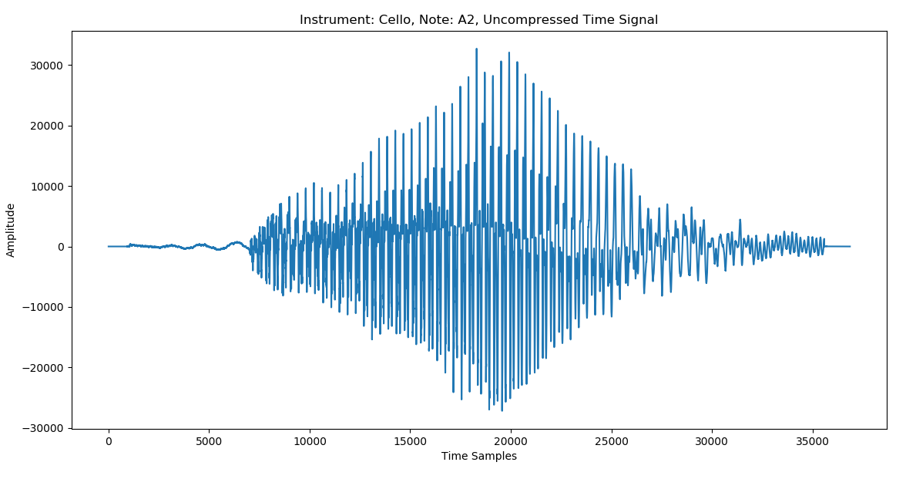

# Musical-Instrument-Decoder
Notes 08/04/2018
This project attempts to decode musical notes from a musical instrument. This is a final project for cs 542 at Boston University

neuralnet_01 seems to work pretty ok. I conducted unit testing with various 2 bit logical boolean functions with different numbers of hidden layers and different layer sizes. [2,2,1] was the minimum neural net initialization that was necessary. Using sigmoid only converged half of the time. Using tanh as the activation function worked much better, and worked 100% of the time on the boolean function test cases. On a side note, there is weird negative predications sometimes when using tanh activation function. 

fft_features_01 is a work in progress

decoder_02.py, decoder_09.py can be ignored.

Notes 08/05/2018
Preprocessing the data takes a very long time.
I estimate that in order to generate 0.15 sec fft with 1024 for each file will take approximately 1 hour.
Reasons it may be taking a long time:
some ffts may be taking longer than they should.
To fix this problem:
	for each file:
		downsample the data
			splice the data
				get the ffts
	store all the ffts in a labeled file using json.
	
So when training the data,
	Only have load json file
	
Also 0.6 sec is about 1/(100 beats per minute), so 0.3, 0.2 are good splice times

Note: 08/06/2018
preprocess_02.py handles the processing of all of the data.
neuralnet_01.py is a large neuralnet

# Musical-Instrument-Decoder ##

### Contributors###
* AKA The Instrumental Specialists *
* Ben Gutierrez
    * Wrote all project code, including:
	    * preprocess.py
		* neuralnet.py
		* note_sorter.py
		* api.py
	* Talked about preprocessing in final presentation
	* Wrote about preprocessing and neural network in final paper
	* Maintains the project for future updates
* Ellen Mak
    * Contributed substantially to final presentation
	    * Answered all class questions
		* Wrote the PowerPoint talking notes
	* Trained and tested instrumental data
	    * Tuned neural network parameters to get a good model for the data
		* Generated plots of models of interest
	* Wrote about training and testing the data in the final paper
	    * Also formatted all plots, reference, and style in latex NIPS format
* Rohan Pahwa
    * Contributed to final presentation
	    * Talked about overall process, dataset, and introduction
    * Wrote introduction and abstract for final paper
	* Trained and tested notes data
	    * Tuned neural network parameters to get a good model for the data
		* Generated plots of models of interest

### Introduction ###
* Identify which instrument is playing
* Identify which note is playing 
* Overarching goal: generate a score of the music being played

### Our Approach ###
* Pre-processing
	* Mp3 to wav file
	* Label the data in folders
	* Downsample
	* Take subsample
	* Take FFT
	* Use One-side of FFT
* Training
	* Neural Network
	* Different activation functions 
	* Different number layers
	* Different number nodes per layer
* Testing
	* Upper Threshold
	* Lower Threshold

### Data Set ###
* From Philharmonia Orchestra Sound Samples
* Samples of different instruments playing different notes 
	* 2,478 samples
	* Flute (190 samples)
	* Cello (875 samples)
	* Saxophone (722 samples)
	* Clarinet (617 samples)
	* Banjo (74 samples)
	
### Preprocessing ###
* Mp3 to wav
* Take sample of file - downsample
* Take a subsample of the data (2048 data points in the center)
* Take FFT for frequency transform
* Take One-Side of FFT
* Put data and labels in directory

### Preprocessing: Mp3 to Wav

)

<html>
<body>

  
    <h2>Contributors</h2>
    <i><strong>AKA The Instrumental Specialists</strong> </i>
  
    <h3><strong>Ben Gutierrez</strong></h3>
    <i>Massachusetts Institute of Technology</i>
      <ul>   
        <li>Wrote all project code, including:
	      <ul>
	        <li>preprocess.py</li>
		    <li>neuralnet.py</li>
		    <li>note_sorter.py</li>
		    <li>api.py</li>
		  </ul>
        </li>
	    <li>Talked about preprocessing in final presentation</li>
	    <li>Wrote about preprocessing and neural network in final paper</li>
	    <li>Maintains the project for future updates</li>
	  </ul>
  
    <h3><strong>Ellen Mak</strong></h3>
    <i>Boston University</i>
	  <ul>
        <li>Contributed substantially to final presentation
	      <ul>
	        <li>Answered all class questions</li>
		    <li>Wrote the PowerPoint talking notes</li>
		  </ul>
	    </li>
	    <li>Trained and tested instrumental data
	      <ul>
	        <li>Tuned neural network parameters to get a good model for the data</li>
		    <li>Generated plots of models of interest</li>
		  </ul>
	    </li>
	    <li>Wrote about training and testing the data in the final paper
	      <ul>
	        <li>Also formatted all plots, reference, and style in latex NIPS format</li>
		  </ul>
	    </li>
	  </ul>
	
    <h3><strong>Rohan Pahwa</strong></h3>
    <i>Boston College</i>
	  <ul>
        <li>Contributed to final presentation
	      <ul>
	        <li>Talked about overall process, dataset, and introduction</li>
		  </ul>
	    </li>
        <li>Wrote introduction and abstract for final paper</li>
	    <li>Trained and tested notes data
	      <ul>
	        <li>Tuned neural network parameters to get a good model for the data</li>
		    <li>Generated plots of models of interest</li>
		  </ul>
	    </li>
      </ul>
  
 
 
   <h2>Code</h2>
   

   Please open api.py to see the Application Program Interface for the Musical Instrument Decoder software. Please look at the demos in main to learn how to use the code. The demos will be replicated below.
   

 

</body>
</html>