<h1>Musical Instrument Decoder</h1>

<h2>Table of Contents</h2>
  <ol>
	<li><a href="#code"><b>Code</b></a></li>
	<li><a href="#abstract"><b>Abstract</b></a></li>
	<li><a href="#introduction"><b>Introduction</b></a></li>
	<li><a href="#methods"><b>Methods</b></a>
	  <ul>
	    <li><a href="#dataset"><b>Dataset</b></a></li>
		<li><a href="#preprocessing 1"><b>Preprocessing</b></a></li>
		<li><a href="#neural network"><b>Neural Network</b></a></li>
	  </ul>
	</li>
	<li><a href="#experiments"><b>Experiments and Results</b></a>
	  <ul>
	    <li><a href="#preprocessing 2"><b>Preprocessing</b></a></li>
		<li><a href="#instrument number"><b>Number of Instruments</b></a></li>
		<li><a href="#pitch"><b>Pitch Training and Testing</b></a></li>
	  </ul>
	</li>
	</li>
	<li><a href="#conclusion"><b>Conclusion</b></a>
	  <ul>
	    <li><a href="#contributors"><b>Contributors</b></a></li>
	    <li><a href="#acknowledgments"><b>Acknowledgments</b></a></li>
		<li><a href="#references"><b>References</b></a></li>
	  </ul>
	</li>
  </ol>
 
<h2 id="code">Code</h2>
  

    Please open api.py to see the Application Program Interface for the Musical Instrument Decoder software. Please look at the demos in the main function in api.py to learn how to use the code. The demos will be replicated below.
  

  
<b><u>
  XOR Example Code
  </u></b>

  
  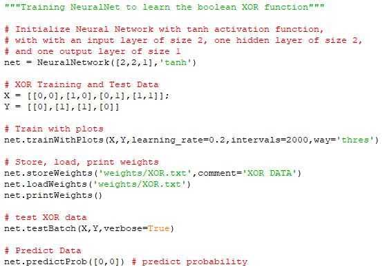 
  
  
<b><u>
  XOR Example Output
  </u></b>

  
  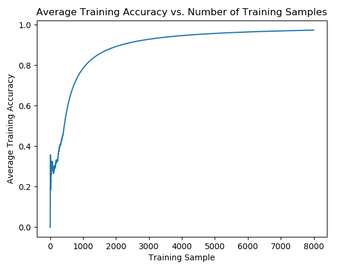
  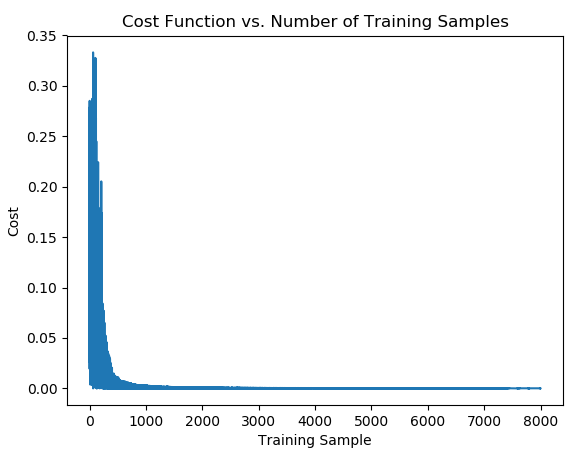
  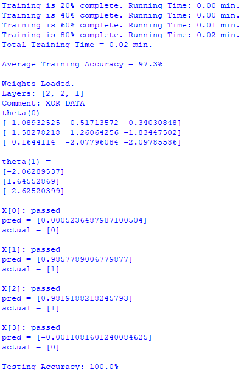

  
<b><u>
  Training Code 6 Instruments (Update: 08/26/2018)
  </u></b>

  

  Instruments: bassoon, cor anglais, flute, guitar, oboe, and tuba
  

  
  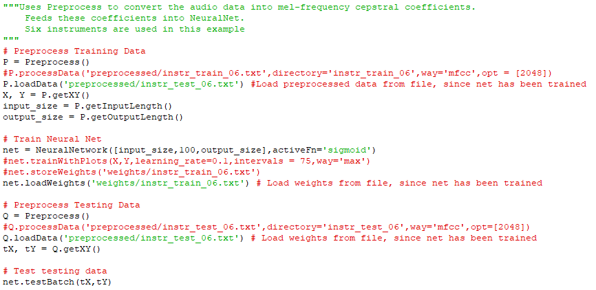
  
  
<b><u>
  Output for 6 Instruments (Testing Accuracy: 90.0%)
  </u></b>

  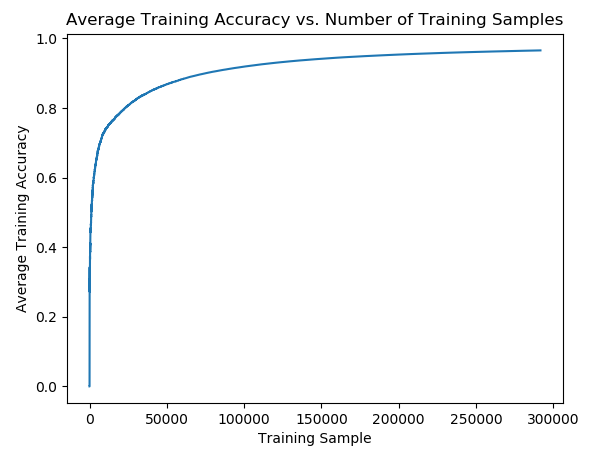
  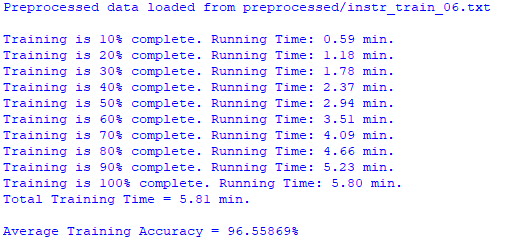
  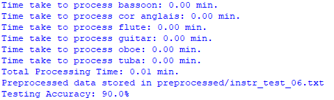    
  
  
<b><u>
  Training Code 10 Instruments (Update: 08/26/2018)
  </u></b>

  

  Instruments: bassoon, cello, cor anglais, flute, guitar, oboe, saxophone, trombone, trumpet, and tuba
  

  
  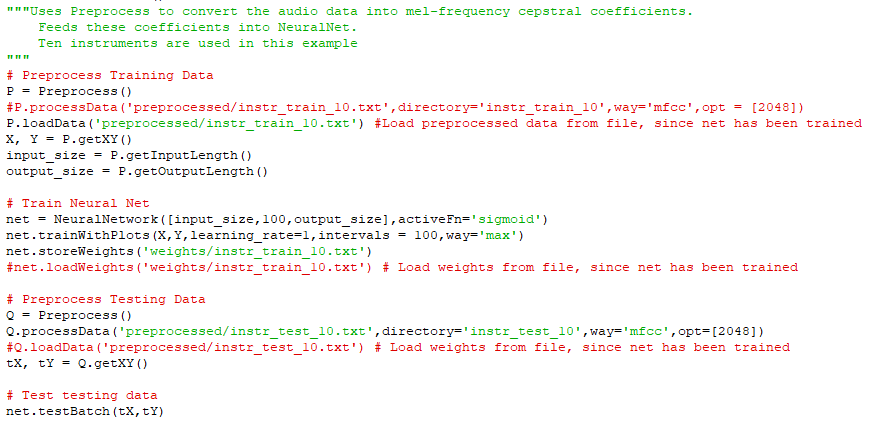
  
  
<b><u>
  Output for 10 Instruments (Testing Accuracy: 69.3%)
  </u></b>

  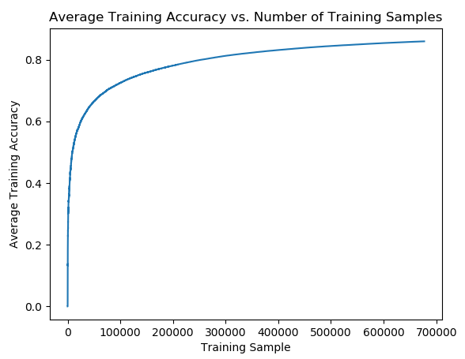
  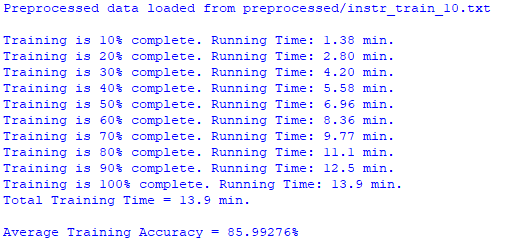
  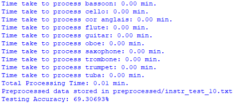
  
<h2 id="abstract">Abstract</h2>
  

  Neural Networks have been applied to a multitude of testing scenarios. The goal here was to use neural networks and audio samples from various instruments to identify both the instrument and pitchof a given sample. The intent was to use these developed neural networks to create a tool that could combine both pitch and instrument information to help users create sheet music, by instrument, from a given audio file. Analysis was done using log based Fast Fourier Transform and Mel Frequency Cepstral Coefficients to simplify audio information to make it easily processed by the neural network without loss of important audio characteristics.
  

  

<h2 id="introduction">Introduction</h2>
  

  Every instrument has its own special characteristics defined by its shape, size, length of its strings, tuning, age, quality, etc. Underneath all these factors, the sound of an instrument is defined by its frequencies and resonances. Recognizing these patterns in frequencies and resonances is difficult for humans but an analysis of this data can allow a neural network to recognize and categorize this data.  What humans do excel at is the the ability to identify the difference between a cheap or expensive instrument while still recognizing that they are in fact the same instrument. Every instrument has a unique frequency pattern that defines it and can be used to identify it regardless of most of those other factors. In addition, musical pitches also have consistent patterns from instrument to instrument that can be identified. The goal is to train a neural network to identify instruments while ignoring all the other extraneous factors regarding the particular instrument itself including pitch. Fast Fourier Transform (FFT) and Mel Frequency Cepstral Coefficients (MFCC) were used to create frequency data plots to train the neural networks. Various levels of testing was performed to understand the importance of training iterations, sample sizes, and over-fitting. All the data was obtained from Philharmonia Orchestra Sound Samples to keep data simple and consistent. This limited the number of extraneous factors in our testing while providing us with consistent, high quality data with large sample sizes for most instruments. 
  

  
  

  The FFT and MFCC break down our processed audio samples in two ways. FFT gives us the frequencies for each sample and treats them as if they are periodic throughout the sample and MFCC gives us coefficients for a spectrogram to see frequency data over time. These combined, provide us with enough data to create input vectors for our neural network to train and identify instruments. The same processing methods can be used to process audio for pitch identification while ignoring octaves.
  

<h2 id="methods">Methods</h2>
  

  This section will discuss the data set we obtained, the preprocessing process, and the neural network we implemented. 
  

<h3 id="dataset">Dataset</h3>
  

  Our data set was taken from the Philharmonia Orchestra Sound Samples. The data had samples of different instruments, lengths, pitch, dynamics, and articulations. The database offered 20 instruments with a total of 13,686 samples. Below is a breakdown of the number of samples per instrument.
  

  
  <ul>
    <li>banjo (74 samples)</li>
	<li>bass clarinet (945 samples)</li>
	<li>bassoon (721 samples)</li>
	<li>cello (889 samples)</li>
	<li>clarinet (847 samples)</li>
	<li>contrabassoon (711 samples)</li>
	<li>cor anglais (682 samples)</li>
	<li>double bass (853 samples)</li>
	<li>flute (879 samples)</li>
	<li>french horn (651 samples)</li>
	<li>guitar (107 samples)</li>
	<li>mandolin (81 samples)</li>
	<li>oboe (597 samples)</li>
	<li>percussion (149 samples)</li>
	<li>saxophone (732 samples)</li>
	<li>trombone (832 samples)</li>
	<li>trumpet (486 samples)</li>
	<li>tuba (973 samples)</li>
	<li>viola (974 samples)</li>
	<li>violin (1502 samples)</li>
  </ul>
  
  

  The samples were initially mp3 files, but we decompressed them into wav files using a mp3 to wav converter. We then labeled all of our data by putting them into their respective folder. 
  

<h3 id="preprocessing 1">Preprocessing</h3>
<h4>Method 1: FFT Approach</h4>
  

  In order to tackle the problem of instrument recognition, we tried a frequency based approach. We took samples of audio data sampled at 44,100 Hz. We then down-sampled the signals in the time domain by a factor of 4, which in turn lowered our sample rate by a factor of 4. In addition, down-sampling has the effect of mapping higher frequencies to lower frequencies and can cause distortion. One way to prevent this distortion is to add a low pass filter with the cutoff frequency at the new sampling rate. We did not add a low pass filter because the power of our signals at high frequencies was quite small. Next we extracted 2048 sample points in the center of our signal. Then we took the fast-frequency transform (FFT) of the shrunken signal. This gave us the frequency content of our signal. We then removed the left hand side of the FFT. The FFT breaks down the signal into complex components and produces both negative and positive frequency components. Because our signal is real the negative frequency components are redundant. After we removed the left hand side of the FFT, we took the log of the each of the FFT frequencies. This is based on the idea of human hearing, as humans tend to associate exponential changes as linear ones. Finally in order to regularize our data, we divided each frequency component by the maximum amplitude in the frequency spectrum.
  

<h4>Method 2: MFCC Approach</h4>  
  

  The second method we used was Mel-Frequency Cepstral Coefficients. The idea behind this method is to generate a spectrogram of frequency versus time.
  

  
  

  First, we applied a pre-emphasis filter on our audio signal. The pre-emphasis filter helps to balance the frequency spectrum by weighting higher frequencies. Higher frequencies tend to to have much smaller magnitudes than lower ones.
  

  
  
<b><u>
  Pre-Emphasis Filter (a=filter coefficient - 0.95 or 0.97)
  </u></b>

  
  
  
  

  After apply a pre-emphasizing filter, we split the signal into separate time frames. The frequency of the signal changes over time, and by splitting the data into time frames we can can capture this additional frequency content.
  

  
  

  Next, we applied a hamming window to each of the time frames. The FFT assumes that the signal is infinitely periodic. If the ends of the time signal do not match up, the signal will contain some additional high frequency noise not present in the original signal. The hamming window helps correct this by bringing the ends of the time signal closer together. 
  

  
  
<b><u>
  Hamming Window
  </u></b>
  
  
  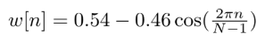
  
  

  Next we took the FFT of each frame to get the frequency content for each frame. We then took the spectral density for each time frame. The following equation describes the distribution of power for each of the frequency components in the signal. 
  

  
  
<b><u>
  Power Spectrum Equation (N typically 256 or 512)
  </u></b>

  
  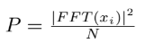  
  
  

  In our next step, we created filter banks using triangular filters in order to transform the frequencies in the spectral density to their corresponding frequency bands. We used the Mel-scale because it distinguishes higher frequency stronger than lower frequencies. Once we applied the filter bank across each of the power frames obtained in the spectrogram with frequency along one axis and time along another axis. The equations below are the triangular filters applied to each of the power frames.
  

  
<b><u>
  Filter Bank Equations
  </u></b>

  
  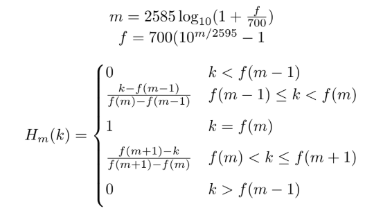
 
  

  We then applied the discrete time cosine transform (DCT). The DCT helps to decorrelate the mel-frequency cepstral ceofficients (MFCCs). We chose to use the lower 12 MFCCs because higher coefficients represent fast changes in frequency between two adjacent time frames. The frequency content from musical instrument signals should not be changing rapidly between time frames.
  

  
  

  Next we applied a sinusoidal filter to the MFCCs to penalize higher MFCCs. This has been done in speech recognition algorithms to help with signal with signals with high signal to noise ratios. We used the assumption that our signal to noise ratio was low because our audio data was recorded at a high sample rate of 44,100 Hz, with good equipment, and with reliable instrument voices. The sinusoidal filtering increases the flexibility of the algorithm if it were to be used in real life with noisy audio signals.
  

  
  

  The final step of pre-processing was to normalize and regularize the MFCCs. Regularization was accomplished by subtracting the mean of MFCCS for each time row. Normalization was accomplished by dividing the MFCCS by the max coefficient for each time row. By normalizing our data we insured that our inputs into our neural network would be in the range between [-1:1].
  

<h3 id="neural network">Neural Network</h3>
  

  We used a fully connected artificial neural net (ANN) as our choice of machine learning algorithm. We chose to use an ANN because of its popularity in image classification problems. An image can be thought of as a two-dimensional signal, which is similar to the concept of MFCCS with both time and frequency labels for each coefficient. 
  

  
  

  Figure 1: Example of neural network structure
  

  
  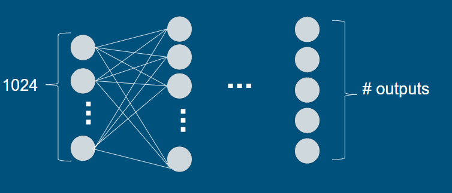

  

  We also were not certain if the variation between instruments or notes was due to a linear combination among features. If it happened to be the case that the the variation among instruments or notes was due to a linear combinations of the features we would have used multivariate regression. In our log based FFT method, the features were the logs of the FFT components, whereas in the MFCC method the features were the coefficients themselves. In both methods, it is hard to determine whether or not the output variables are linear combinations of the features.
  

  
  

  We used forward propagation to calculate the hypothesis vector. We then used stochastic gradient descent without regularization in order to learn from our input vectors.
  

  
  

  When training our data, we would control the number of iterations, the type of activation function, the number of layers, and the size of each layer. In addition, we randomized the order that our input feature vectors were sent into our training algorithm. We had first implemented a sequential process when training with our input vectors, but noticed improvements in our training accuracy when using a random lottery based process.
  

  
  
<b><u>
  Cost Function
  </u></b>

  
  
  
  

    <i>J</i>: Cost of weight matrix <i>theta</i> 
	<i>y[i]</i>: Target values of layer <i>i</i> 
	<i>a[i]</i>: Activation values of layer <i>i</i>
  

     
  
<h2 id="experiments">Experiments and Results</h2>
  

  In this section, we will discuss how our process evolved throughout this project and the results obtained at each step. 
  

<h3 id="preprocessing 2">Preprocessing</h3>  
  

  Throughout this project we encountered many difficulties with deciding how to preprocess the data. Since we were working with audio data, preprocessing was an essential part of obtaining the appropriate data to put into our neural network. We saw that changing the preprocessing step significantly changed our results. 
  

  
  

   Initially, our preprocessing steps included taking the Fast Fourier Transform of the sound input, then downsampling the data by a factor of 4. We then trained and tested the preprocessed instrument data through our neural network (learning rate=0.01, interval=100, activation function=sigmoid). The neural network had 1024 input nodes, one hidden layer with 100 nodes, and 3 output nodes. As seen in Figure 1, the cost function for 3 instruments decreased overall, but there were consistent spikes throughout the graph. Also the training accuracy through each sample would initially shoot up to 100% then range somewhere between 97% to 99%. Although our training accuracy was 98.7%, the testing accuracy was 33.3%, which is as good as randomly guessing. We once obtained our best testing accuracy of 40%, but this was not consistent. 
  

  

  Figure 2: Cost function from only taking the Fast Fourier Transform and downsampling.
  
  
  
  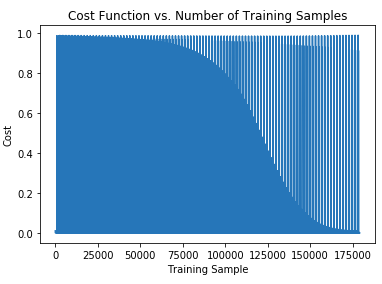
  
  

  After getting these results, we decided that we needed to change our preprocessing methods. Instead of just taking the Fast Fourier Transform, we also took the Mel-Frequency Cepstral Coefficients. Inputting 3 instruments (cello, flute, and saxophone), our neural network (learning rate=1, intervals=100, activation function=sigmoid) had 36 input nodes, 100 nodes in the hidden layer, and 3 output nodes. After training the preprocessed instrument data, we were able to get a 97.1% training accuracy with a desirable graph shown below. After testing our test data, we were able to obtain a testing accuracy of 86.7%. 
  

  
  

  Figure 3: Training accuracy after taking the MFCC
  

  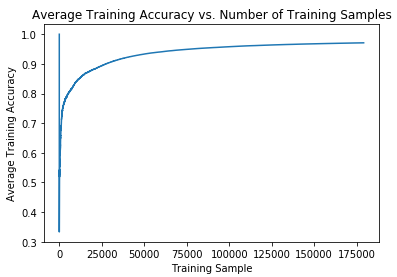
  
<h3 id="instrument number">Increasing the Number of Instruments</h3> 
  

  After changing our preprocessing method, we tried training and testing with an increased number of instruments from 3 instruments (cello, flute, saxophone) to 5 instruments (cello, clarinet, banjo, flute, saxophone). Unfortunately we obtained a lower training accuracy of 81.3% and a testing accuracy of 62%. 
  

  
  

  Moving forward, we wondered if we could increase our accuracy by looking at the interval, or the number of iterations through our data. We thought that we might have been overfitting our data, making our training and testing accuracy lower. We first tried decreasing our interval from 100 to 20, which is one fifth since we are using 5 instruments instead of 3. Both the training and testing accuracy decreased. We then doubled our interval to 40 iterations. After, we increased and decreased our interval and we saw that the interval of 50 gave us the best result, as shown in Table 1. 
  

  
  

  Figure 4: Table that shows the effect of number of training intervals on training accuracy and testing accuracy
  

  
  <table>
    <tr>
	  <td>Intervals</td>
	  <td>Training Accuracy</td>
	  <td>Testing Accuracy</td>
	</tr>
    <tr>
	  <td>20</td>
	  <td>68.8%</td>
	  <td>60%</td>
	</tr>
    <tr>
	  <td>40</td>
	  <td>77.6%</td>
	  <td>70%</td>
	</tr>
	  <td>45</td>
	  <td>76.4%</td>
	  <td>70%</td>
    <tr>
	  <td>50</td>
	  <td>78.5%</td>
	  <td>78%</td>
	</tr>
    <tr>
	  <td>55</td>
	  <td>78.4%</td>
	  <td>76%</td>
	</tr>
    <tr>
	  <td>100</td>
	  <td>81.3%</td>
	  <td>62%</td>
    </tr>	
  </table>

<h3 id="sample size">Increasing Sample Size</h3>   
  

  Finally, we looked at the sampling size for each category and how it affected our training and testing accuracy. We saw that our sampling size for banjo was only 74, so we tried switching it out with an instrument with a larger sample size. We replaced the banjo with the tuba and ended up with a training accuracy of 94%  and a testing accuracy of 90%, shown in Figure 3. This was the highest testing accuracy that we obtained. 
  

  

  Figure 5: Training Accuracy using cello, clarinet, flute, saxophone, and tuba with 50 intervals, learning rate of 0.01, and activation function of sigmoid.
  

  
  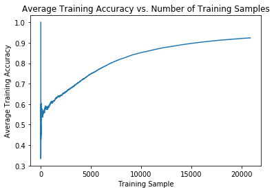

<h3 id="pitch">Pitch Training and Testing</h3>    
  

  We also tried training and testing with the pitch. We saw that when we used 2 pitches (B and F), we obtained a training accuracy of 91.5% and a testing accuracy of 86.6% (Figure 4). Unfortunately, when we increased to three notes (B, C, and F), the accuracy for both training and testing drastically decreased to 82% and 67.5%, as seen in Figure 5. Although we did not further investigate the problem, we think we might need to further preprocess the data or process the data specifically for the pitch. 
  

  

  Figure 6: Training Accuracy for two pitches (B and F)
  

  
  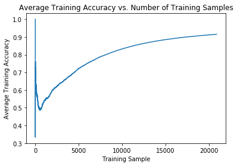

  

  Figure 7: Training Accuracy for three pitches (B,C, and F)
  

  
  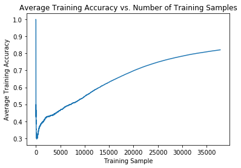

<h2 id="conclusion">Conclusion</h2>  
  

  Overall, we saw that the preprocessing step, the number of instruments, and the sample size affected our accuracy. Since we were dealing with audio, preprocessing was essential to our project. We saw that changing our methods from only taking the Fast Fourier Transform to taking the Fast Fourier Transform and the Mel-Frequency Cepstral Coefficient drastically improved our results. Also when increasing the number of instruments, we came across the problem of overfitting and the importance of sample size. To further our study, we would want to try to train and test the pitch and the duration of each note to eventually generate a score, from a given audio file, by overlaying the results obtained from both neural networks.
  

<h3 id="contributors">Contributors</h3>
<i><strong>AKA The Instrumental Specialists</strong> </i>
  
<h4><strong>Ben Gutierrez</strong></h4>
<i>Massachusetts Institute of Technology</i>
  <ul>   
    <li>Wrote all project code, including:
	  <ul>
	    <li>preprocess.py</li>
		<li>neuralnet.py</li>
		<li>note_sorter.py</li>
		<li>api.py</li>
  </ul>
    </li>
	<li>Talked about preprocessing in final presentation</li>
	<li>Wrote about preprocessing and neural network in final paper</li>
	<li>Maintains the repository project for future updates</li>
  </ul>
  
<h4><strong>Ellen Mak</strong></h4>
<i>Boston University</i>
  <ul>
    <li>Contributed substantially to final presentation
      <ul>
	    <li>Talked about training and testing</li>
	    <li>Wrote down answers to class questions</li>
	    <li>Wrote the PowerPoint talking notes</li>
	   </ul>
    </li>
    <li>Trained and tested instrumental data
	  <ul>
	    <li>Tuned neural network parameters to get a good model for the data</li>
        <li>Generated plots of models of interest</li>
	  </ul>
	</li>
	<li>Wrote about experiments,results, and conclusion in the final paper
	  <ul>
	    <li>Also formatted all plots, reference, and style in latex NIPS format</li>
      </ul>
	</li>
  </ul>
	
<h4><strong>Rohan Pahwa</strong></h4>
<i>Boston College</i>
  <ul>
    <li>Contributed to final presentation
	  <ul>
	    <li>Talked about overall process, dataset, and introduction</li>
	  </ul>
	</li>
    <li>Wrote introduction and abstract for final paper</li>
	<li>Trained and tested notes data
	  <ul>
	    <li>Tuned neural network parameters to get a good model for the data</li>
		<li>Generated plots of models of interest</li>
      </ul>
	</li>
  </ul>  
  
<h3 id="acknowledgments">Acknowledgments</h3>
  

    This work was done for the Machine Learning course (CS542) at Boston University.
  

<h3 id="references">References</h3>  
  <ol>
    <li>

	Fayek, Haytham. <q>Speech Processing for Machine Learning: Filter Banks, Mel-Frequency Cepstral Coefficients (MFCCs) and What's In-Between.</q> <i>Speech Processing for Machine Learning: Filter Banks, Mel-Frequency Cepstral Coefficients (MFCCs) and What's In-Between</i>, Haytham Fayek, 21 Apr. 2016, haythamfayek.com/2016/04/21/speech-processing-for-machine-learning.html.
	
</li>
    <li>

	Han, Yoonchang, et al. <q>Deep Convolutional Neural Networks for Predominant Instrument Recognition in Polyphonic Music</q>. <i>IEEE/ACM Transactions on Audio, Speech, and Language Processing</i>, vol. 25, no. 1, 2017, pp. 208 to 221., doi:10.1109/taslp.2016.2632307.
	
</li>
	<li>

	Mitra, Vikramjit, et al. <q>Robust Features in Deep-Learning-Based Speech Recognition.</q> <i>New Era for Robust Speech Recognition</i>, 2017, pp. 187 to 217., doi:10.1007/978-3-319-64680-0_8.
	
</li>
	<li>

	Yoshioka, T., and M.j.f. Gales. <q>Environmentally Robust ASR Front-End for Deep Neural Network Acoustic Models.</q> <i>Computer Speech & Language</i>, vol. 31, no. 1, 2014, pp. 65 to 86., doi:10.1016/j.csl.2014.11.008.
	
</li>
  </ol>
  

  

  
